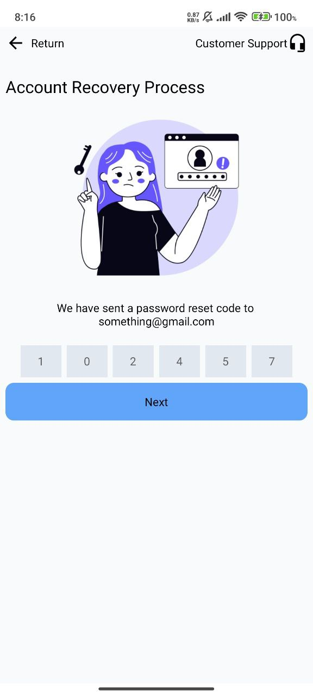

# 📊 myanwin2D-mobile-preview

This repo contains real screen outputs from the MyanWin2D mobile app, built with React Native. It's a visual-only development showcase — no code is shared here. All UI was built directly with code, not with design tools like Figma.

---

### 📱 Signup Screen

The **Signup Screen** is the entry point of the MyanWin2D mobile app.

Since the app involves **stock market prediction with win/loss outcomes**, users are required to sign up before participating. This is done to:

- ✅ Track user identity for managing payouts
- ✅ Ensure each prediction is tied to a unique account

**Login options include:**

- **Email** – a simple, widely supported method
- **Google** – for users who prefer one-tap sign-in
- **Telegram** – selected due to its high usage rate in Myanmar

> 🛑 _Age or region restrictions are not enforced. Signup is open to all users._  
> 📌 _Only a visual preview is shown. Source code and backend logic are not included for intellectual property protection._

**📷 Screenshot Preview:**  

---

### 🔐 Login Screen

The **Login Screen** provides returning users with access to the MyanWin2D app.

It supports the same sign-in options introduced during signup, allowing users to log in with:

- **Email**
- **Google**
- **Telegram**

This ensures consistency across user sessions and simplifies access for users who prefer one-tap or chat-based logins.

> 🔁 _All login methods are optional during signup, but required to re-enter the app._  
> 📌 _Only a visual preview is included. Codebase and backend logic remain private._

**📷 Screenshot Preview:**  

---

### 🔄 Forgot Password Screen

The **Forgot Password Screen** helps users recover their account access if they forget their login credentials.

This screen only supports **Email-based recovery**, as email is the primary and most consistent login method across users.

> 📩 _Users enter their registered email to receive a recovery link._  
> 🚫 _Google and Telegram logins do not support password-based recovery._  
> 📌 _This is a visual-only preview. No code or backend logic is shared._

**📷 Screenshot Preview:**  

---

---

### 🔑 Code Confirmation Screen

The **Code Confirmation Screen** is part of the account recovery process.

- After users request a password reset via email, they receive a numeric code.
- This screen allows users to enter the reset code to verify their identity.
- Input fields are designed as separate boxes for each digit to improve clarity and reduce input errors.
- Users can easily return to the login screen or access customer support from here.

> 🔒 _This verification step ensures only authorized users can reset their password._  
> 📌 _Visual preview only; backend logic is kept private for intellectual property protection._

**📷 Screenshot Preview:**  

---

## 📸 Screenshots

Visuals of screens built and tested on physical devices. Each image includes a short description of its role in the app flow.

- [x] Signup Screen — user onboarding and identity tracking
- [x] Login Screen — returning user authentication
- [x] Forgot Password Screen — email-based account recovery
- [x] Code Confirmation Screen — code input for password reset verification
- [x] Search Agent | Browse and find payment agents

_More screens will be added soon..._

---

## 🕵️‍♂️ Search Agent Screen

The **Search Agent Screen** allows users to browse and find verified agents who support deposits, withdrawals, or assistance.

#### Key Features:

- **Search Bar:** Filter agents by **name** or **Agent ID**
- **Agent List View:**
  - 🧑 Agent Name
  - 🆔 Agent ID (unique identifier)
  - 💰 Accepted Payment Methods (displayed with recognizable icons like WavePay, KBZPay, etc.)

#### Purpose:

This screen enhances **user trust and transaction safety** by providing a clear and searchable list of authorized agents.

> 🧾 This is a **read-only UI preview**. Real-time data and payment integrations are handled privately in the backend.

**📷 Screenshot:**  

---

## 🛠️ Tech Stack

- **Framework:** React Native
- **Platform:** Android (tested on physical device)
- **Auth Options:** Email, Google, Telegram
- **Screenshots:** Taken directly from device
- **Design Tools:** No external design tools were used (e.g., Figma)

---

## 📦 Project Status

🧪 **In Development** – Screens are being developed and shared gradually.  
🚫 Codebase is private and not part of this repository.

---

## 📃 License

© 2025 **CVNXSolution**

This project’s content (screen images) is licensed under the  
[Creative Commons Attribution-NonCommercial-NoDerivatives 4.0 International (CC BY-NC-ND 4.0)](http://creativecommons.org/licenses/by-nc-nd/4.0/).

You may share and redistribute the material with proper credit, but not use it commercially or create derivatives.

---

## 👤 Author

All screen images in this repo were created by **cvnxsolution** in 2025.  
They are protected under the CC BY-NC-ND 4.0 license.
